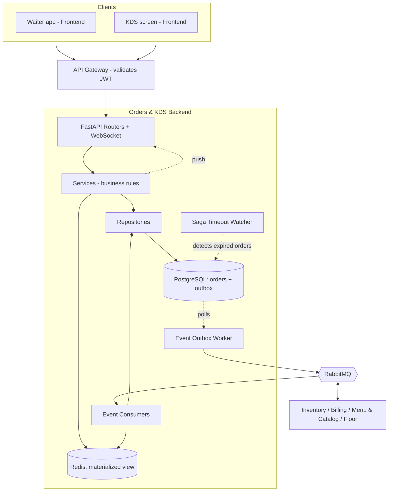
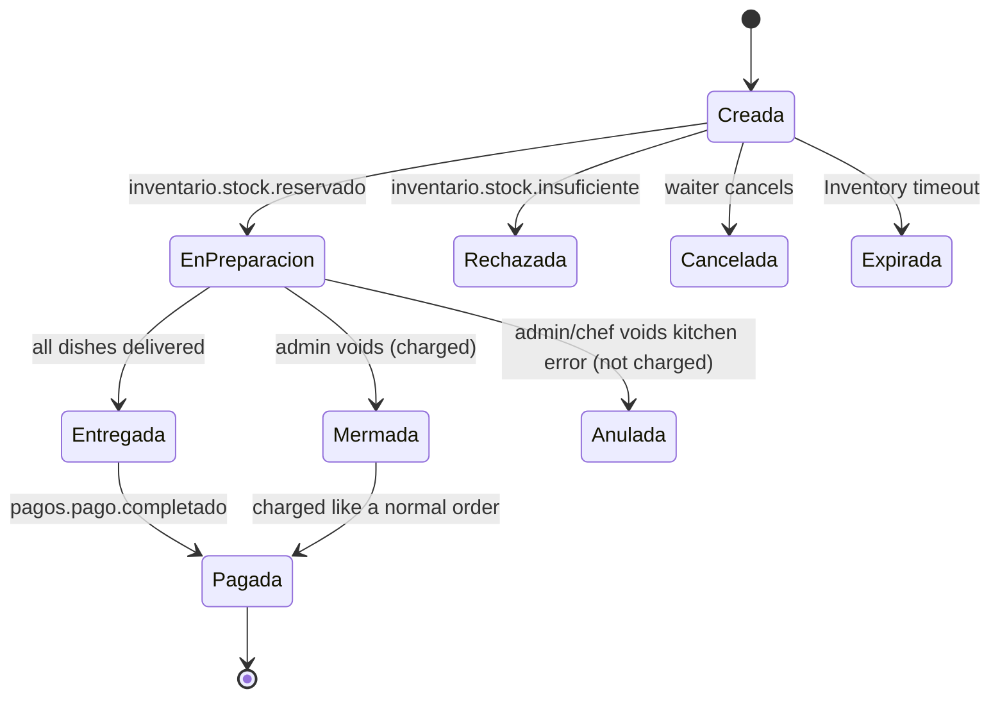
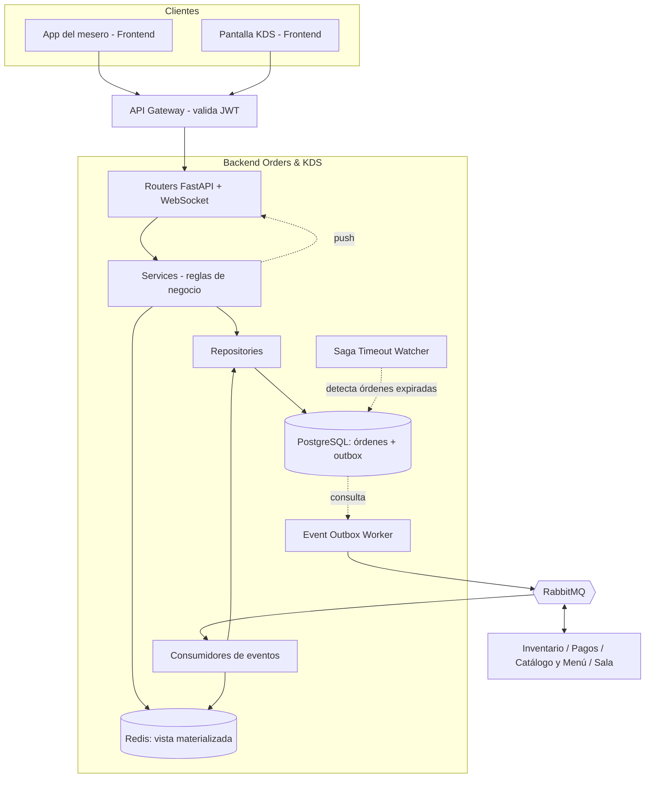
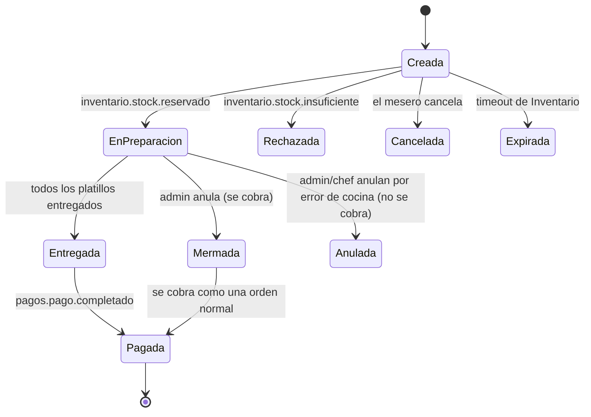

# Orders & KDS — Backend

[](https://www.python.org)
[](https://fastapi.tiangolo.com)
[](https://www.postgresql.org)
[](https://redis.io)
[](https://www.rabbitmq.com)
[](https://www.docker.com)
[](https://github.com/features/actions)
[](https://sonarcloud.io)

---

**Orders & KDS** is the *Orders and Kitchen* microservice (Microservice 4) of a distributed restaurant management system. It owns the full lifecycle of a customer order (*comanda*), feeds the Kitchen Display System (KDS) with the preparation queue, and coordinates with the rest of the system (Auth, Menu & Catalog, Floor, Inventory, Billing) **exclusively through events**.

This repository contains the **backend**: a REST + WebSocket API built with Python and FastAPI, a PostgreSQL database with the Transactional Outbox pattern, a Redis materialized view of external data, and RabbitMQ consumers/publishers. The web client lives in the sibling repository `ordenes-kds-frontend`.

Key design rules:

- **100% event-driven.** No synchronous calls to other business microservices. The only documented exception is the bootstrap/reconciliation sync with Menu & Catalog, which never runs inside a user request.
- **Transactional Outbox.** A state change and the event it produces are written in the same PostgreSQL transaction; an independent *Event Outbox Worker* publishes them to RabbitMQ (at-least-once delivery, so every consumer is idempotent).
- **Choreographed Saga.** An order only reaches the kitchen queue after Inventory answers `inventario.stock.reservado`.
- **Real-time push.** State changes reach waiters and kitchen screens through WebSockets, never through polling.

### Table of Contents

- [Team Members](#team-members)
- [Technology Stack](#technology-stack)
- [Architecture Overview](#architecture-overview)
- [Order Lifecycle](#order-lifecycle)
- [Quick Start](#quick-start)
- [Project Structure](#project-structure)
- [Running Tests](#running-tests)
- [Documentation](#documentation)
- [Contributing](#contributing)

---

### Team Members

| # | Name | Role | GitHub | Contact |
|---|---|---|---|---|
| 1 | Suarez Balam Brandon Emanuel| Networking, Security & Concurrency Lead | [@BS435](https://github.com/BS435) | |
| 2 | Contreras Gamboa Emiliano | Backend Architect | [@EmiCG](https://github.com/EmiCG) | |
| 3 | Dzib Pech Luis Gilberto| V&V/QA Lead | [@LuisGilDzib](https://github.com/LuisGilDzib) | |
| 4 | Martínez Martínez José Pablo | Scrum Master | [@Jose-Pablo-Martinez](https://github.com/Jose-Pablo-Martinez) | |
| 5 | Matu Aguayo Leonardo Daniel | Frontend Architect | [@leonardodanielmaguayo-hub](https://github.com/leonardodanielmaguayo-hub) | |
| 6 | Vega Nolasco Erick Ricardo| Database Lead | [@eriveingsoft](https://github.com/eriveingsoft) | |

---

### Technology Stack

#### Application
| Technology | Version | Purpose |
|---|---|---|
|  | 3.12 | Main language (fully typed with type hints) |
|  | 0.11x | Async REST API and native WebSocket support for the KDS push channel |
| **Pydantic** | 2.x | Request/response validation and typed event schemas |
| **SQLAlchemy** + **Alembic** | 2.x | ORM / query builder (parameterized queries only) and schema migrations |
| **aio-pika** | 9.x | Async RabbitMQ client for consumers and the outbox publisher |

#### Data & Messaging
| Technology | Purpose |
|---|---|
|  | ACID transactions, `outbox` table, JSONB columns for order modifiers, optimistic concurrency (`version` column) |
|  | Materialized view of external IDs (tables, menu catalog) fed by events, so no synchronous calls are needed |
|  | Event broker (topic exchange) with Dead Letter Queues for failed messages |

#### Infrastructure & DevOps
| Technology | Purpose |
|---|---|
|  | The service and its database are containerized; `docker compose` for local development |
|  | CI/CD pipeline: lint, tests, coverage, SonarCloud, contract tests, k6, OWASP ZAP |
|  | Static analysis, Quality Gate, coverage and technical debt tracking |

#### Testing
| Technology | Purpose |
|---|---|
| **pytest** + **pytest-asyncio** + **pytest-cov** | Unit tests (with mocks) and coverage reports |
| **Testcontainers** | Ephemeral real PostgreSQL / RabbitMQ containers for repository and outbox integration tests |
| **pytest-bdd** (Gherkin) | Behavior-driven acceptance scenarios for the API |
| **Postman + Newman** | Automated API and JSON-schema contract tests |
| **k6** | Load, stress and performance-regression tests |
| **OWASP ZAP** | Dynamic security scanning (DAST) |

---

### Architecture Overview



Every state change follows the same path: **Router → Service → Repository → PostgreSQL (state + outbox in one transaction) → Outbox Worker → RabbitMQ**. Incoming events follow the reverse path through the consumers and end with a WebSocket push to the affected screens.

---

### Order Lifecycle

Main flow: `Creada` (CREATED) → `EnPreparacion` (IN_PREPARATION) → `Entregada` (DELIVERED) → `Pagada` (PAID).
Alternative states: `Cancelada` (CANCELLED), `Rechazada` (REJECTED), `Mermada` (WASTED), `Anulada` (VOIDED), `Expirada` (EXPIRED).



> The English names in parentheses are the identifiers used in the code. The mapping is defined in [`DEVELOPMENT_GUIDELINES.md`](docs/DEVELOPMENT_GUIDELINES.md).

---

### Quick Start

#### Prerequisites

- **Python** 3.12+ — [python.org](https://www.python.org)
- **Docker Desktop** (includes Docker Compose v2; WSL 2 on Windows) — [docker.com](https://www.docker.com)
- **Git** 2.40+
- *(Recommended)* a PostgreSQL client such as **DBeaver** or **pgAdmin** to browse the database. A local PostgreSQL *server* is **not** needed: the database runs in a container.
- *(Optional, for the full test suite)* **k6**, **Newman** (`npm i -g newman`)

> Step-by-step installation, verification commands, ports, troubleshooting and how to connect a visual DB client: [QUICKSTART.md §5–§7](QUICKSTART.md).
>
> New to Docker? Read the basic team guide (in Spanish) on how Docker works locally and the cloud scope (TASK-38): [docs/GUIA_DOCKER.md](docs/GUIA_DOCKER.md).

#### Installation

**Option A — automated bootstrap (recommended for a clean machine):**

```bash
# 1. Clone the repository
git clone https://github.com/your-org/ordenes-kds-backend.git
cd ordenes-kds-backend

# 2. Run the bootstrap script — creates .venv, installs deps, generates .env
# Windows PowerShell:
.\scripts\bootstrap.ps1
# macOS / Linux:
bash scripts/bootstrap.sh
```

The script prints every next step (edit `.env`, start Docker, run migrations).

**Option B — manual steps:**

```bash
# 1. Clone the repository
git clone https://github.com/your-org/ordenes-kds-backend.git
cd ordenes-kds-backend

# 2. Create and activate a virtual environment
python -m venv .venv
source .venv/bin/activate          # Windows: .venv\Scripts\activate

# 3. Install dependencies
pip install -r requirements/dev.txt

# 4. Set up environment variables
python scripts/setup_env.py        # generates .env with local defaults
# Edit .env and set SAGA_TIMEOUT_SECONDS (agree value with team)

# 5. Start the infrastructure (PostgreSQL, Redis, RabbitMQ)
docker compose up -d postgres redis rabbitmq

# 6. Apply database migrations
alembic upgrade head

# 7. Start the API (terminal 1)
uvicorn app.main:app --reload --port 8000

# 8. Start the background workers (terminal 2)
python -m app.workers.run_all
```

The API will be available at `http://localhost:8000` and the interactive OpenAPI docs at `http://localhost:8000/docs`. The RabbitMQ management UI is at `http://localhost:15672`.

> **Note:** authentication is handled by the Auth microservice. For local development use the token generator in `scripts/dev_token.py` to create JWTs with the roles `waiter`, `kitchen`, `chef` or `admin`.

---

### Project Structure

```
ordenes-kds-backend/
├── .github/
│   ├── ISSUE_TEMPLATE/
│   ├── PULL_REQUEST_TEMPLATE.md
│   └── workflows/
│       └── ci.yml                    # Lint + tests + coverage + Sonar + contract/perf/security jobs
│
├── app/
│   ├── main.py                       # FastAPI application factory
│   ├── api/                          # Controllers: HTTP routers and WebSocket endpoints
│   │   ├── routers/                  # orders.py, kds.py, admin.py, intermediate_dishes.py
│   │   ├── websockets/               # kds_socket.py, waiter_socket.py
│   │   ├── dependencies/             # Auth context (userId + role from JWT), DB session
│   │   └── schemas/                  # Pydantic request/response models
│   ├── services/                     # Business rules and lifecycle transitions
│   ├── domain/                       # OrderStatus, state machine, domain errors
│   ├── repositories/                 # SQL access (SQLAlchemy), UUID <-> internal ID mapping
│   ├── db/                           # Models, session, Alembic migrations
│   ├── messaging/
│   │   ├── consumers/                # Handlers for inventario.*, pagos.*, menu.*, sala.* events
│   │   ├── publisher.py              # RabbitMQ publishing used by the outbox worker
│   │   └── events.py                 # Event names and typed payload schemas (versioned)
│   ├── workers/                      # outbox_worker.py, saga_timeout_watcher.py, catalog_reconciliation.py
│   ├── cache/                        # Redis materialized view (tables, catalog)
│   └── core/                         # Config, logging, security, error codes
│
├── contracts/
│   └── events/                       # JSON Schemas of every published/consumed event
│
├── tests/
│   ├── unit/                         # Services and domain logic with mocks
│   ├── integration/                  # Repositories + outbox with Testcontainers
│   ├── contract/                     # Event and REST contract tests
│   ├── bdd/                          # Gherkin .feature files + step definitions
│   ├── api/postman/                  # Postman collection + environments (run with Newman)
│   ├── performance/                  # k6 scripts
│   └── security/zap/                 # OWASP ZAP configuration and rules
│
├── scripts/                          # dev_token.py, seed data, helpers
├── docs/                             # Full project documentation
├── docker-compose.yml
├── docker-compose.ci.yml
├── Dockerfile
├── alembic.ini
├── pyproject.toml                    # ruff, mypy, pytest and coverage configuration
├── sonar-project.properties
└── .env.example
```

---

### Running Tests

```bash
# Unit tests
pytest tests/unit -v

# Unit tests with coverage report
pytest tests/unit --cov=app --cov-report=term-missing --cov-report=xml

# Integration tests (starts ephemeral PostgreSQL/RabbitMQ containers, Docker required)
pytest tests/integration -v

# Contract tests
pytest tests/contract -v

# BDD acceptance scenarios (Gherkin)
pytest tests/bdd -v

# API collection with Newman (API must be running)
newman run tests/api/postman/orders-kds.postman_collection.json \
  -e tests/api/postman/local.postman_environment.json

# Load test with k6
k6 run tests/performance/load.js

# Static analysis and typing
ruff check . && ruff format --check . && mypy app
```

The complete strategy (levels, tools, thresholds and traceability) is described in [`docs/VyV_OrdenesKDS.md`](docs/VyV_OrdenesKDS.md).

---

### Documentation

Full documentation is in the [`docs/`](docs/) folder:

| Document | Description |
|---|---|
| [`ERS_ordeneskds.md`](docs/ERS_ordeneskds.md) | Software Requirements Specification (v4) |
| [`Arquitectura_ordeneskds.md`](docs/Arquitectura_ordeneskds.md) | Complete architecture: internal API and published events |
| [`Comunicaciones_API_ordenes_y_KDS.md`](docs/Comunicaciones_API_ordenes_y_KDS.md) | Synchronous (REST/WebSocket) and asynchronous (broker) communication |
| [`ordenes-kds-diagramas-secuencia.md`](docs/ordenes-kds-diagramas-secuencia.md) | Sequence diagrams of every event flow |
| [`DEVELOPMENT_GUIDELINES.md`](docs/DEVELOPMENT_GUIDELINES.md) | Coding standards and rules for humans and AI agents |
| [`VyV_OrdenesKDS.md`](docs/VyV_OrdenesKDS.md) | Verification & Validation plan |
| [`CONTRIBUTING.md`](docs/CONTRIBUTING.md) | Contribution guidelines and workflow |

---

### Contributing

1. Read [`docs/DEVELOPMENT_GUIDELINES.md`](docs/DEVELOPMENT_GUIDELINES.md) and [`CONTRIBUTING.md`](CONTRIBUTING.md) before contributing.
2. Create a branch from `develop`:
   ```bash
   git checkout -b feat/your-feature-name
   ```
3. Make sure everything passes locally before opening a PR:
   ```bash
   ruff check . && mypy app
   pytest tests/unit tests/integration
   ```
4. Open a Pull Request against `develop` using the provided template.
5. The CI pipeline and the SonarCloud Quality Gate must pass before any PR can be merged.

---
---

## Español

**Orders & KDS** es el microservicio de *Órdenes y Cocina* (Microservicio 4) de un sistema distribuido de gestión de restaurantes. Es dueño del ciclo de vida completo de una comanda, alimenta la cola de preparación de la pantalla de cocina (KDS) y se coordina con el resto del sistema (Auth, Catálogo y Menú, Sala, Inventario, Pagos) **exclusivamente mediante eventos**.

Este repositorio contiene el **backend**: una API REST + WebSocket construida con Python y FastAPI, una base de datos PostgreSQL con el patrón Transactional Outbox, una vista materializada de datos externos en Redis, y consumidores/publicadores de RabbitMQ. El cliente web vive en el repositorio hermano `ordenes-kds-frontend`.

Reglas de diseño clave:

- **100% orientado a eventos.** No hay llamadas síncronas a otros microservicios de negocio. La única excepción documentada es la sincronización de arranque/reconciliación con Catálogo y Menú, que nunca se ejecuta dentro de una petición de usuario.
- **Transactional Outbox.** Un cambio de estado y el evento que produce se escriben en la misma transacción de PostgreSQL; un *Event Outbox Worker* independiente los publica en RabbitMQ (entrega *at-least-once*, por lo que todo consumidor es idempotente).
- **Saga coreografiada.** Una orden solo llega a la cola de cocina cuando Inventario responde `inventario.stock.reservado`.
- **Push en tiempo real.** Los cambios de estado llegan a meseros y pantallas de cocina por WebSocket, nunca por polling.

### Tabla de Contenidos

- [Miembros del Equipo](#miembros-del-equipo)
- [Stack Tecnológico](#stack-tecnológico-1)
- [Visión General de la Arquitectura](#visión-general-de-la-arquitectura)
- [Ciclo de Vida de la Orden](#ciclo-de-vida-de-la-orden)
- [Instalación Rápida](#instalación-rápida)
- [Estructura del Proyecto](#estructura-del-proyecto-1)
- [Ejecución de Tests](#ejecución-de-tests)
- [Documentación](#documentación-1)
- [Contribución](#contribución-1)

---

### Miembros del Equipo

| # | Nombre | Rol | GitHub | Contacto |
|---|---|---|---|---|
| 1 | Suarez Balam Brandon Emanuel| Líder de redes, seguridad y concurrencia | [@BS435](https://github.com/BS435) | |
| 2 | Contreras Gamboa Emiliano | Arquitecto backend | [@EmiCG](https://github.com/EmiCG) | |
| 3 | Dzib Pech Luis Gilberto| Responsable VyV-QA| [@LuisGilDzib](https://github.com/LuisGilDzib) | |
| 4 | Martínez Martínez José Pablo | Scrum master | [@Jose-Pablo-Martinez](https://github.com/Jose-Pablo-Martinez) | |
| 5 | Matu Aguayo Leonardo Daniel | Arquitecto Frontend | [@leonardodanielmaguayo-hub](https://github.com/leonardodanielmaguayo-hub) | |
| 6 | Vega Nolasco Erick Ricardo| Líder de base de datos | [@eriveingsoft](https://github.com/eriveingsoft) | |

---

### Stack Tecnológico

#### Aplicación
| Tecnología | Versión | Propósito |
|---|---|---|
|  | 3.12 | Lenguaje principal (totalmente tipado con type hints) |
|  | 0.11x | API REST asíncrona y soporte nativo de WebSockets para el canal push hacia el KDS |
| **Pydantic** | 2.x | Validación de peticiones/respuestas y esquemas tipados de eventos |
| **SQLAlchemy** + **Alembic** | 2.x | ORM / query builder (solo consultas parametrizadas) y migraciones de esquema |
| **aio-pika** | 9.x | Cliente asíncrono de RabbitMQ para consumidores y publicador del outbox |

#### Datos y Mensajería
| Tecnología | Propósito |
|---|---|
|  | Transacciones ACID, tabla `outbox`, columnas JSONB para modificadores, concurrencia optimista (columna `version`) |
|  | Vista materializada de IDs externos (mesas, catálogo) alimentada por eventos, sin llamadas síncronas |
|  | Broker de eventos (exchange tipo topic) con Dead Letter Queues para mensajes fallidos |

#### Infraestructura y DevOps
| Tecnología | Propósito |
|---|---|
|  | El servicio y su base de datos están contenerizados; `docker compose` para desarrollo local |
|  | Pipeline CI/CD: lint, tests, cobertura, SonarCloud, pruebas de contrato, k6, OWASP ZAP |
|  | Análisis estático, Quality Gate, cobertura y deuda técnica |

#### Testing
| Tecnología | Propósito |
|---|---|
| **pytest** + **pytest-asyncio** + **pytest-cov** | Tests unitarios (con mocks) y reportes de cobertura |
| **Testcontainers** | Contenedores efímeros reales de PostgreSQL / RabbitMQ para pruebas de integración de repositorios y outbox |
| **pytest-bdd** (Gherkin) | Escenarios de aceptación guiados por comportamiento para la API |
| **Postman + Newman** | Pruebas automatizadas de API y de contrato (validación de esquemas JSON) |
| **k6** | Pruebas de carga, estrés y regresión de rendimiento |
| **OWASP ZAP** | Escaneo dinámico de seguridad (DAST) |

---

### Visión General de la Arquitectura



Todo cambio de estado sigue el mismo camino: **Router → Service → Repository → PostgreSQL (estado + outbox en una transacción) → Outbox Worker → RabbitMQ**. Los eventos entrantes siguen el camino inverso por los consumidores y terminan con un push por WebSocket a las pantallas afectadas.

---

### Ciclo de Vida de la Orden

Flujo principal: `Creada` (CREATED) → `EnPreparacion` (IN_PREPARATION) → `Entregada` (DELIVERED) → `Pagada` (PAID).
Estados alternativos: `Cancelada` (CANCELLED), `Rechazada` (REJECTED), `Mermada` (WASTED), `Anulada` (VOIDED), `Expirada` (EXPIRED).



> Los nombres en inglés entre paréntesis son los identificadores usados en el código. La equivalencia está definida en [`DEVELOPMENT_GUIDELINES.md`](docs/DEVELOPMENT_GUIDELINES.md).

---

### Instalación Rápida

#### Prerrequisitos

- **Python** 3.12+ — [python.org](https://www.python.org)
- **Docker Desktop** (incluye Docker Compose v2; WSL 2 en Windows) — [docker.com](https://www.docker.com)
- **Git** 2.40+
- *(Recomendado)* un cliente de PostgreSQL como **DBeaver** o **pgAdmin** para explorar la base de datos. **No** se necesita un *servidor* PostgreSQL local: la base de datos corre en un contenedor.
- *(Opcional, para la suite completa de pruebas)* **k6**, **Newman** (`npm i -g newman`)

> Instalación paso a paso, comandos de verificación, puertos, solución de problemas y cómo conectar un cliente visual de BD: [QUICKSTART.md §5–§7](QUICKSTART.md).
>
> ¿Primera vez con Docker? Lee la guía básica del equipo sobre cómo funciona Docker en local y el alcance en la nube (TASK-38): [docs/GUIA_DOCKER.md](docs/GUIA_DOCKER.md).

#### Pasos

**Opción A — bootstrap automatizado (recomendado en máquina limpia):**

```bash
# 1. Clonar el repositorio
git clone https://github.com/tu-org/ordenes-kds-backend.git
cd ordenes-kds-backend

# 2. Ejecutar el script de bootstrap — crea .venv, instala dependencias y genera .env
# Windows PowerShell:
.\scripts\bootstrap.ps1
# macOS / Linux:
bash scripts/bootstrap.sh
```

El script imprime cada siguiente paso (editar `.env`, levantar Docker, correr migraciones).

**Opción B — pasos manuales:**

```bash
# 1. Clonar el repositorio
git clone https://github.com/tu-org/ordenes-kds-backend.git
cd ordenes-kds-backend

# 2. Crear y activar un entorno virtual
python -m venv .venv
source .venv/bin/activate          # Windows: .venv\Scripts\activate

# 3. Instalar dependencias
pip install -r requirements/dev.txt

# 4. Configurar variables de entorno
python scripts/setup_env.py        # genera .env con valores locales por defecto
# Editar .env y establecer SAGA_TIMEOUT_SECONDS (acordar con el equipo)

# 5. Levantar la infraestructura (PostgreSQL, Redis, RabbitMQ)
docker compose up -d postgres redis rabbitmq

# 6. Aplicar las migraciones de base de datos
alembic upgrade head

# 7. Levantar la API (terminal 1)
uvicorn app.main:app --reload --port 8000

# 8. Levantar los workers en segundo plano (terminal 2)
python -m app.workers.run_all
```

La API estará disponible en `http://localhost:8000` y la documentación OpenAPI interactiva en `http://localhost:8000/docs`. La interfaz de administración de RabbitMQ está en `http://localhost:15672`.

> **Nota:** la autenticación la maneja el microservicio de Auth. En desarrollo local usa el generador de tokens de `scripts/dev_token.py` para crear JWT con los roles `waiter`, `kitchen`, `chef` o `admin`.

---

### Estructura del Proyecto

```
ordenes-kds-backend/
├── .github/
│   ├── ISSUE_TEMPLATE/
│   ├── PULL_REQUEST_TEMPLATE.md
│   └── workflows/
│       └── ci.yml                    # Lint + tests + cobertura + Sonar + jobs de contrato/rendimiento/seguridad
│
├── app/
│   ├── main.py                       # Fábrica de la aplicación FastAPI
│   ├── api/                          # Controladores: routers HTTP y endpoints WebSocket
│   │   ├── routers/                  # orders.py, kds.py, admin.py, intermediate_dishes.py
│   │   ├── websockets/               # kds_socket.py, waiter_socket.py
│   │   ├── dependencies/             # Contexto de auth (userId + rol desde el JWT), sesión de BD
│   │   └── schemas/                  # Modelos Pydantic de entrada/salida
│   ├── services/                     # Reglas de negocio y transiciones del ciclo de vida
│   ├── domain/                       # OrderStatus, máquina de estados, errores de dominio
│   ├── repositories/                 # Acceso SQL (SQLAlchemy), mapeo UUID <-> ID interno
│   ├── db/                           # Modelos, sesión, migraciones Alembic
│   ├── messaging/
│   │   ├── consumers/                # Handlers de eventos inventario.*, pagos.*, menu.*, sala.*
│   │   ├── publisher.py              # Publicación a RabbitMQ usada por el outbox worker
│   │   └── events.py                 # Nombres de eventos y esquemas tipados (versionados)
│   ├── workers/                      # outbox_worker.py, saga_timeout_watcher.py, catalog_reconciliation.py
│   ├── cache/                        # Vista materializada en Redis (mesas, catálogo)
│   └── core/                         # Configuración, logging, seguridad, códigos de error
│
├── contracts/
│   └── events/                       # JSON Schemas de cada evento publicado/consumido
│
├── tests/
│   ├── unit/                         # Services y lógica de dominio con mocks
│   ├── integration/                  # Repositories + outbox con Testcontainers
│   ├── contract/                     # Pruebas de contrato de eventos y REST
│   ├── bdd/                          # Archivos .feature Gherkin + step definitions
│   ├── api/postman/                  # Colección Postman + entornos (se ejecuta con Newman)
│   ├── performance/                  # Scripts k6
│   └── security/zap/                 # Configuración y reglas de OWASP ZAP
│
├── scripts/                          # dev_token.py, datos semilla, utilidades
├── docs/                             # Documentación completa del proyecto
├── docker-compose.yml
├── docker-compose.ci.yml
├── Dockerfile
├── alembic.ini
├── pyproject.toml                    # Configuración de ruff, mypy, pytest y cobertura
├── sonar-project.properties
└── .env.example
```

---

### Ejecución de Tests

```bash
# Tests unitarios
pytest tests/unit -v

# Tests unitarios con reporte de cobertura
pytest tests/unit --cov=app --cov-report=term-missing --cov-report=xml

# Tests de integración (levanta contenedores efímeros de PostgreSQL/RabbitMQ, requiere Docker)
pytest tests/integration -v

# Pruebas de contrato
pytest tests/contract -v

# Escenarios de aceptación BDD (Gherkin)
pytest tests/bdd -v

# Colección de API con Newman (la API debe estar corriendo)
newman run tests/api/postman/orders-kds.postman_collection.json \
  -e tests/api/postman/local.postman_environment.json

# Prueba de carga con k6
k6 run tests/performance/load.js

# Análisis estático y tipado
ruff check . && ruff format --check . && mypy app
```

La estrategia completa (niveles, herramientas, umbrales y trazabilidad) está descrita en [`docs/VyV_OrdenesKDS.md`](docs/VyV_OrdenesKDS.md).

---

### Documentación

La documentación completa se encuentra en la carpeta [`docs/`](docs/):

| Documento | Descripción |
|---|---|
| [`ERS_ordeneskds.md`](docs/ERS_ordeneskds.md) | Especificación de Requisitos de Software (v4) |
| [`Arquitectura_ordeneskds.md`](docs/Arquitectura_ordeneskds.md) | Arquitectura completa: API interna y eventos publicados |
| [`Comunicaciones_API_ordenes_y_KDS.md`](docs/Comunicaciones_API_ordenes_y_KDS.md) | Comunicación síncrona (REST/WebSocket) y asíncrona (broker) |
| [`ordenes-kds-diagramas-secuencia.md`](docs/ordenes-kds-diagramas-secuencia.md) | Diagramas de secuencia de cada flujo de eventos |
| [`DEVELOPMENT_GUIDELINES.md`](docs/DEVELOPMENT_GUIDELINES.md) | Estándares de código y reglas para humanos y agentes IA |
| [`VyV_OrdenesKDS.md`](docs/VyV_OrdenesKDS.md) | Plan de Verificación y Validación |
| [`CONTRIBUTING.md`](docs/CONTRIBUTING.md) | Guías de contribución y flujo de trabajo |
| [`GUIA_DOCKER.md`](docs/GUIA_DOCKER.md) | Guía básica de uso de Docker en local y alcance en la nube (TASK-38) |

---

### Contribución

1. Lee [`docs/DEVELOPMENT_GUIDELINES.md`](docs/DEVELOPMENT_GUIDELINES.md) y [`CONTRIBUTING.md`](CONTRIBUTING.md) antes de contribuir.
2. Crea una rama a partir de `develop`:
   ```bash
   git checkout -b feat/nombre-de-la-funcionalidad
   ```
3. Asegúrate de que todo pase localmente antes de abrir un PR:
   ```bash
   ruff check . && mypy app
   pytest tests/unit tests/integration
   ```
4. Abre un Pull Request contra `develop` usando el template proporcionado.
5. El pipeline de CI y el Quality Gate de SonarCloud deben pasar antes de que cualquier PR pueda ser mergeado.
