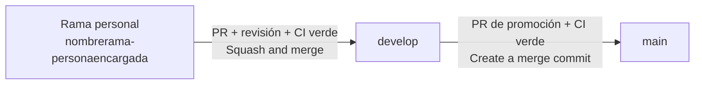

# Contribuir a Orders & KDS — Backend

> **Repositorio:** `ordenes-kds-backend`
> **Idioma de este documento:** español · **Idioma del código, commits, ramas y PRs:** inglés
>
> Este documento explica **cómo trabajar** en el repositorio: flujo de ramas, commits, Pull Requests, entorno local y revisión. Los **estándares de código** viven en [`docs/DEVELOPMENT_GUIDELINES.md`](docs/DEVELOPMENT_GUIDELINES.md). Si algo de aquí contradice la sección 12 de esa guía, prevalece la guía y este archivo se corrige.

---

## Tabla de contenido

1. [Antes de empezar](#1-antes-de-empezar)
2. [Flujo de trabajo: rama-persona → develop → main](#2-flujo-de-trabajo-rama-persona--develop--main)
3. [Convención de nombres de rama](#3-convención-de-nombres-de-rama)
4. [Conventional Commits](#4-conventional-commits)
5. [Pull Requests](#5-pull-requests)
6. [Promoción de develop a main](#6-promoción-de-develop-a-main)
7. [Entorno local y variables de entorno](#7-entorno-local-y-variables-de-entorno)
8. [Verificación local antes de abrir un PR](#8-verificación-local-antes-de-abrir-un-pr)
9. [Cambios que afectan al frontend (contratos)](#9-cambios-que-afectan-al-frontend-contratos)
10. [Decisiones de arquitectura (ADR)](#10-decisiones-de-arquitectura-adr)
11. [Puntos abiertos: no se resuelven en silencio](#11-puntos-abiertos-no-se-resuelven-en-silencio)
12. [Seguridad](#12-seguridad)
13. [Si trabajas con un agente de IA](#13-si-trabajas-con-un-agente-de-ia)
14. [Errores frecuentes y cómo repararlos](#14-errores-frecuentes-y-cómo-repararlos)
15. [Protección de ramas (para mantenedores)](#15-protección-de-ramas-para-mantenedores)

---

## 1. Antes de empezar

1. Levanta el proyecto siguiendo el [`README.md`](README.md) (sección *Quick Start*).
2. Lee, como mínimo:
   - [`docs/DEVELOPMENT_GUIDELINES.md`](docs/DEVELOPMENT_GUIDELINES.md): estándares, regla de idioma y directivas para agentes IA.
   - [`docs/ERS_ordeneskds.md`](docs/ERS_ordeneskds.md) y [`docs/Arquitectura_ordeneskds.md`](docs/Arquitectura_ordeneskds.md): qué se construye y con qué eventos/endpoints.
   - [`docs/Comunicaciones_API_ordenes_y_KDS.md`](docs/Comunicaciones_API_ordenes_y_KDS.md): Outbox, idempotencia y WebSocket.
3. Todo cambio debe poder ligarse a un requisito (`RF-XX` / `RNF-XX`) del catálogo de [`docs/VyV_OrdenesKDS.md`](docs/VyV_OrdenesKDS.md). Si no encaja en ninguno, coméntalo en el issue antes de programar.

### Reglas que nunca se rompen

| Regla | Detalle |
|---|---|
| **Código 100 % en inglés** | Identificadores, comentarios, logs, tests, `.feature`, commits, ramas y PRs (guía §2). Solo la documentación en `docs/` va en español. |
| **Solo eventos** | Ninguna llamada síncrona a otro microservicio de negocio; la única excepción es la reconciliación con Catálogo, fuera de cualquier request de usuario (guía §3.5). |
| **Outbox siempre** | Nada se publica directo a RabbitMQ: estado + fila `outbox` en la misma transacción (guía §5.5). |
| **Nada de trabajo directo en `develop` ni `main`** | Ver sección 2. |

---

## 2. Flujo de trabajo: rama-persona → develop → main

Todo cambio recorre **siempre** las mismas tres etapas. No hay atajos, tampoco para urgencias.



### 2.1 Las tres capas

| Rama | Propósito | ¿Se escribe directamente? | Recibe cambios de |
|---|---|---|---|
| `nombrerama-personaencargada` | Trabajo de una persona en una tarea concreta | Sí, solo su dueña/o | — |
| `develop` | Integración: todo lo aprobado y listo para probarse en conjunto | **No** | PRs de ramas personales |
| `main` | Producción: solo lo que ya vivió y se validó en `develop` | **No** | PR de promoción desde `develop` |

Este esquema da control sobre los cambios: cada cambio tiene un dueño identificable (el nombre está en la rama), pasa por revisión antes de mezclarse con el trabajo de los demás y solo llega a producción tras haberse integrado y verificado en `develop`.

### 2.2 Paso a paso

```bash
# 1. Parte siempre de develop actualizado
git checkout develop
git pull origin develop

# 2. Crea tu rama personal: nombrerama-personaencargada
git checkout -b voidkitchenerror-pablo

# 3. Trabaja en commits pequeños (formato Conventional Commits, sección 4)
git add app/services/order_service.py tests/unit/services/test_void_kitchen_error.py
git commit -m "feat(orders): add void-kitchen-error endpoint for admin and chef [RF-28, RF-29, RF-31]"

# 4. Publica tu rama (la primera vez)
git push -u origin voidkitchenerror-pablo

# 5. Antes de pedir revisión, ponte al día con develop
git fetch origin
git rebase origin/develop
git push --force-with-lease          # necesario tras un rebase; nunca uses --force a secas

# 6. Abre el Pull Request en GitHub:  base = develop  ←  compare = tu rama
```

Después del merge:

```bash
git checkout develop
git pull origin develop
git branch -d voidkitchenerror-pablo     # la rama remota se borra desde GitHub al hacer merge
```

### 2.3 Reglas del flujo

- **Toda rama nace de `develop`**, nunca de otra rama personal ni de `main`.
- **Una rama = una persona = una tarea.** No se comparten ramas ni se hacen commits en la rama de otra persona. Si dos personas colaboran, cada una trabaja en su propia rama y se integran vía `develop`.
- **Ramas cortas.** Idealmente viven días, no semanas. Si crece más de ~400 líneas cambiadas, divide el trabajo en varias ramas.
- **Un solo camino:** rama personal → `develop` → `main`. Está prohibido:
  - hacer commit o push directo a `develop` o `main`;
  - abrir un PR desde una rama personal hacia `main`;
  - mezclar `main` en tu rama personal (si necesitas actualizarte, haz rebase sobre `develop`);
  - reutilizar una rama ya mezclada: para nuevo trabajo, crea una rama nueva desde `develop`.
- **Correcciones urgentes** siguen el mismo flujo (rama personal → `develop` → `main`), con revisión prioritaria y promoción a `main` en cuanto `develop` esté verde. No existe la rama `hotfix`.

---

## 3. Convención de nombres de rama

```
nombrerama-personaencargada
```

- **`nombrerama`**: qué se hace, en **inglés**, en minúsculas, **sin separadores** (solo letras y dígitos), corto (idealmente ≤ 25 caracteres).
- **`-`**: un único guion que separa las dos partes.
- **`personaencargada`**: nombre de pila de quien trabaja la rama, en minúsculas y sin acentos ni `ñ` (`José` → `jose`, `Muñoz` → `munoz`). Si dos integrantes comparten nombre, agrega la inicial del apellido (`pablor`, `pablom`).

Expresión regular que debe cumplir toda rama personal:

```
^[a-z0-9]+-[a-z]+$
```

| ✅ Correcto | Por qué |
|---|---|
| `testingproduct-pablo` | Nombre en inglés + persona |
| `voidkitchenerror-pablo` | Endpoint de anulación por error de cocina [RF-28] |
| `outboxretry-ana` | Reintentos del Outbox Worker |
| `sagatimeout-luis` | Saga Timeout Watcher [RF-35] |
| `stockreservedconsumer-maria` | Consumer de `inventario.stock.reservado` [RF-33] |

| ❌ Incorrecto | Problema |
|---|---|
| `feature/RF-32-publish-order-created` | Estilo anterior: usa `/`, prefijo de tipo y varios guiones |
| `void-kitchen-error-pablo` | Guiones dentro de `nombrerama`; debe ser `voidkitchenerror-pablo` |
| `anulacion-pablo` | Nombre en español |
| `voidkitchenerror` | Falta la persona encargada |
| `pablo` | Falta el nombre de la rama |
| `voidkitchenerror-Pablo` | Mayúsculas |
| `voidkitchenerror-pablo2` | Dígitos en la parte de la persona; usa un nombre de rama distinto (`voidkitchenerrortests-pablo`) |

> **Dónde va el requisito (`RF-XX`)?** No en el nombre de la rama, sino en los commits y en la descripción del PR.
>
> **Tip:** si el cambio requiere PR en este repositorio y en el frontend, usa el **mismo nombre de rama** en ambos: facilita enlazarlos (sección 9).

---

## 4. Conventional Commits

**Todos los commits** de tu rama —no solo el título del PR— deben seguir [Conventional Commits](https://www.conventionalcommits.org/). Sirven para leer el historial de un vistazo, generar changelogs y saber qué tipo de cambio entra a `develop` y a `main`.

### 4.1 Formato

```
<type>(<scope>)[!]: <description> [RF/RNF refs]

[body opcional]

[footer(s) opcional(es)]
```

Reglas de redacción:

1. **En inglés**, en modo imperativo presente: `add`, `fix`, `extract` (no `added`, `adds`, `agrega`).
2. `type` en minúsculas y de la lista de la sección 4.2.
3. `scope` opcional, entre paréntesis, de la lista de la sección 4.3.
4. `description` empieza en minúscula, **sin punto final**. El título completo (incluyendo referencias) mide **≤ 100 caracteres**.
5. Las referencias a requisitos van entre corchetes al final del título: `[RF-31]`, `[RF-28, RF-29]`, `[RNF-01]`.
6. El **body** explica el *por qué* (no el *qué*, que ya dice el diff). Separado del título por una línea en blanco.
7. Los **footers** enlazan issues (`Closes #42`, `Refs #57`) y declaran cambios que rompen compatibilidad (`BREAKING CHANGE: ...`).
8. **Un commit = un cambio lógico.** Si necesitas escribir "y" entre dos tipos distintos (`fix` y `refactor`, por ejemplo), sepáralos en dos commits.

### 4.2 Tipos (todos)

| Tipo | Úsalo cuando... | Ejemplo en este repositorio |
|---|---|---|
| `feat` | Agregas una funcionalidad nueva: endpoint, evento, consumer, regla de negocio, campo de API. | `feat(orders): add void-kitchen-error endpoint for admin and chef [RF-28, RF-29, RF-31]` |
| `fix` | Corriges un comportamiento incorrecto respecto al requisito (un bug). Debe ir con su prueba de regresión. | `fix(outbox): keep row pending when publisher confirm fails [RNF-01]` |
| `docs` | Cambias **solo documentación**: `docs/`, README, docstrings, descripciones OpenAPI sin alterar comportamiento. | `docs(orders): clarify why confirm is idempotent [OP-05]` |
| `style` | Cambios de **formato** que no alteran el significado del código: espacios, comas, orden de imports aplicado por `ruff format`. | `style: apply ruff format to the messaging package` |
| `refactor` | Reestructuras código sin cambiar su comportamiento externo y sin corregir un bug ni agregar funcionalidad. | `refactor(orders): extract outbox repository from order service` |
| `perf` | Mejoras el rendimiento (consultas, índices, uso de memoria) sin cambiar el comportamiento funcional. | `perf(db): add composite index on orders status and created_at` |
| `test` | Agregas, corriges o reorganizas **solo tests** (sin tocar código de producción). | `test(domain): cover every invalid state transition [RF-18]` |
| `build` | Tocas el sistema de build o las dependencias: `Dockerfile`, `requirements/`, `pyproject.toml`, `alembic.ini`. | `build(deps): bump aio-pika to the latest 9.x patch` |
| `ci` | Cambias la configuración de integración continua: `.github/workflows/`, `sonar-project.properties`, umbrales de calidad. | `ci: add OWASP ZAP baseline scan job` |
| `chore` | Mantenimiento que no encaja en los demás y no toca `app/` ni `tests/`: `.gitignore`, `scripts/`, datos semilla. | `chore(scripts): refresh seed data for local development` |
| `revert` | Deshaces un commit anterior. El body indica el hash revertido. | `revert: feat(orders): add void-kitchen-error endpoint` |

`revert` se escribe así:

```
revert: feat(orders): add void-kitchen-error endpoint

This reverts commit 3f2a9c1.
Reason: the endpoint path is still pending agreement with the frontend team (OP-07).
```

#### ¿Qué tipo elijo?

1. ¿Cambia lo que un cliente de la API o un consumidor de eventos puede hacer? Es nuevo → `feat`; estaba mal → `fix`.
2. ¿Solo reorganizas el código y todo se comporta igual? → `refactor`.
3. ¿Solo se ve distinto el formato (sin cambiar lógica)? → `style`.
4. ¿Solo tests? → `test`. ¿Solo documentación? → `docs`.
5. ¿Dependencias, Docker o configuración de build? → `build`. ¿Workflows de CI o Sonar? → `ci`.
6. ¿Ninguna de las anteriores y no toca código de la aplicación? → `chore`.

> Las actualizaciones de dependencias se registran como `build(deps)`, no como `chore`. Recuerda que **agregar** una dependencia nueva exige justificarla en el PR.

### 4.3 Scopes del backend

El scope es opcional pero recomendado. Usa uno de esta lista (si necesitas otro, propónlo en el PR y actualiza la guía §12):

| Scope | Área |
|---|---|
| `orders` | Routers y services de comandas |
| `kds` | Cola KDS, marcado de listo |
| `domain` | Estados, máquina de estados, errores de dominio |
| `outbox` | Tabla `outbox` y Event Outbox Worker |
| `consumers` | Consumers de `inventario.*`, `pagos.*`, `menu.*`, `sala.*` |
| `workers` | Saga Timeout Watcher, reconciliación de catálogo |
| `cache` | Vista materializada en Redis |
| `db` | Modelos, sesión, migraciones Alembic |
| `websocket` | Canales WebSocket de KDS y mesero |
| `security` | Autenticación, autorización por rol |
| `contracts` | JSON Schemas de `contracts/events/` y esquemas de API |
| `deps` | Dependencias (con `build`) |

### 4.4 Cambios que rompen compatibilidad

Renombrar o quitar un campo, cambiar un tipo o retirar un endpoint **rompe el contrato** (guía §9). Márcalo con `!` después del scope y agrega el footer `BREAKING CHANGE:`:

```
feat(contracts)!: rename reason field of order-wasted event [OP-04]

The consumer team needs the new name before the next release.
Both names are published during one release cycle.

BREAKING CHANGE: `motivo` is replaced by `reason` in ordenes.comanda.mermada v2.
```

### 4.5 Ejemplos completos

```
feat(consumers): ignore late stock_reserved on expired orders [RF-35]
fix(orders): reject item edits when the order is not in CREATED [RF-23]
test(orders): add boundary cases for empty and maximum-length note [RF-22]
refactor(domain): move transition table out of the order entity
build(docker): use a multi-stage Dockerfile
ci: fail the pipeline when coverage of new code drops below 85%
```

Ejemplo con body y footer:

```
fix(outbox): keep row pending when publisher confirm fails [RNF-01]

Previously the row was marked as published right after basic_publish,
so a broker restart could lose the event. It is now marked only after
the publisher confirm arrives.

Closes #42
```

---

## 5. Pull Requests

### 5.1 Reglas

- **Base:** siempre `develop` (la única excepción es la promoción `develop` → `main`, sección 6).
- **Un PR = un propósito.** Preferible < 400 líneas cambiadas. Puedes abrirlo como **Draft** temprano para recibir feedback.
- **Título:** en inglés y en formato Conventional Commits. Con *Squash and merge*, el título del PR se convierte en el único commit que entra a `develop`.
- **Descripción:** en inglés, usando la plantilla de [`.github/PULL_REQUEST_TEMPLATE.md`](.github/PULL_REQUEST_TEMPLATE.md). Debe incluir: qué y por qué, `RF/RNF` cubiertos, cómo se probó, si cambia un contrato (API/eventos), y cualquier supuesto sobre un punto abierto (`OP-XX`). Enlaza el issue con `Closes #NN`.

### 5.2 Checklist del autor (Definition of Done)

Marca cada punto en el PR (guía §11.6):

- [ ] Rama con formato `nombrerama-personaencargada`, creada desde `develop`.
- [ ] Todos los commits y el título del PR siguen Conventional Commits.
- [ ] Referencia al menos un `RF-XX`/`RNF-XX`; docstrings con `Satisfies:` y OpenAPI completo.
- [ ] Pruebas unitarias del comportamiento nuevo (éxito **y** al menos un error) y, si toca mensajería o BD, pruebas de integración.
- [ ] Consumers nuevos con prueba de mensaje duplicado (idempotencia).
- [ ] Si cambia un contrato: Pydantic, JSON Schema en `contracts/events/`, colección Postman y `ErrorCode` actualizados.
- [ ] `ruff` y `mypy --strict` sin errores; sin `Any`.
- [ ] CI en verde, incluido el *Quality Gate* de SonarCloud (≥ 85 % de cobertura en código nuevo).
- [ ] Cero secretos y cero vulnerabilidades críticas (`pip-audit`, gitleaks).
- [ ] Sin resolver en silencio ningún punto abierto (sección 11).

### 5.3 Revisión

- Se requiere **al menos 1 aprobación** de alguien distinto al autor. Nadie aprueba su propio PR.
- Todas las conversaciones deben quedar resueltas.
- La rama debe estar actualizada con `develop` y el CI completo en verde. Nunca se desactiva un *check* para "salir del paso".

**Qué mira quien revisa:**

1. ¿Las transiciones de estado pasan por `ensure_transition_allowed` y las publicaciones por `outbox`?
2. ¿`user_id` y `role` salen del JWT y la autorización por rol está en el router?
3. ¿Errores genéricos al cliente con `ErrorCode` y detalle solo en logs?
4. ¿Las pruebas verifican comportamiento real (no solo "tocan líneas")?
5. ¿El código, los comentarios y los logs están en inglés?
6. ¿Se respetan los contratos y los puntos abiertos?

### 5.4 Merge

- **Estrategia hacia `develop`: *Squash and merge*.** El commit resultante usa el título del PR (Conventional Commits) y como cuerpo el resumen del PR.
- Borra la rama al mezclar (activa *Automatically delete head branches* en GitHub).
- Quien mezcla es normalmente el autor, una vez con aprobación y CI verde.

---

## 6. Promoción de develop a main

`main` solo se actualiza mediante un PR de `develop` → `main`.

**Precondiciones:**

- `develop` con CI y *Quality Gate* en verde.
- Sin PRs bloqueantes pendientes de mezclar.
- Verificación funcional de lo acumulado en `develop` (pruebas de aceptación BDD y, si aplica, k6/OWASP ZAP del pipeline en verde).
- Contratos publicados/consumidos coordinados con los otros equipos y con el frontend (sección 9).

**Cómo:**

1. Abre el PR con **base `main`** y **compare `develop`**.
2. Título: `chore(release): promote develop to main`.
3. Descripción: lista de los PRs incluidos (GitHub puede generarla) y cualquier nota de despliegue (migraciones Alembic, nuevas variables de entorno).
4. Requiere 1 aprobación distinta de quien lo abre y CI verde.
5. **Estrategia: *Create a merge commit*** (no squash). Squash en esta etapa haría que `develop` y `main` divergieran en historial y generaría conflictos falsos en la siguiente promoción; además, cada commit que llega de `develop` ya es un Conventional Commit limpio.

---

## 7. Entorno local y variables de entorno

```bash
cp .env.example .env      # .env NUNCA se versiona; solo .env.example (sin valores reales)
```

Reglas: las claves están en inglés y en `UPPER_SNAKE_CASE`; ningún secreto va en código, tests, logs ni imágenes Docker; en CI los secretos viven en *GitHub Secrets* (guía §10.2).

### 7.1 Variables

| Variable | Obligatoria | Descripción | Ejemplo local |
|---|:---:|---|---|
| `DATABASE_URL` | Sí | Conexión async a PostgreSQL 16 (el driver lo define `requirements/`). | `postgresql+asyncpg://<user>:<password>@localhost:5432/<db>` |
| `REDIS_URL` | Sí | Vista materializada de mesas y catálogo. | `redis://localhost:6379/0` |
| `RABBITMQ_URL` | Sí | Broker de eventos. | `amqp://<user>:<password>@localhost:5672/` |
| `SAGA_TIMEOUT_SECONDS` | Sí | Umbral para pasar una orden de `CREATED` a `EXPIRED`. **Sin valor por defecto en el código** (punto abierto OP-01): el servicio debe fallar al iniciar si falta. Acuerda el valor con el equipo. | *(vacío en `.env.example`)* |
| `LOG_LEVEL` | No | Nivel de log estructurado. *(Propuesta)* | `INFO` |
| `OUTBOX_POLL_INTERVAL_SECONDS` | No | Frecuencia con que el Outbox Worker busca filas pendientes. *(Propuesta)* | `1` |
| `CATALOG_SYNC_URL` | No | Endpoint `GET /menu/catalogo/completo` para bootstrap/reconciliación, pendiente de aprobar por Catálogo y Menú. *(Propuesta)* | *(vacío hasta aprobarse)* |
| `CATALOG_RECONCILIATION_INTERVAL_SECONDS` | No | Frecuencia del job de reconciliación; sin definir con el equipo. *(Propuesta)* | *(vacío hasta acordarse)* |

> **JWT:** el API Gateway valida la firma; el backend solo lee `user_id` y `role` de las claims. Por eso **no** existe (ni debe crearse) una variable tipo `JWT_SECRET`. Para desarrollo local usa `scripts/dev_token.py`.

Si agregas una variable: actualiza `.env.example`, esta tabla y menciónalo en el PR (y en las notas de despliegue si es obligatoria).

### 7.2 Problemas de infraestructura local

Consulta la sección 14.3 de la guía de desarrollo (contenedores, Alembic, Testcontainers, consumers y outbox).

---

## 8. Verificación local antes de abrir un PR

```bash
# Estilo, formato y tipos
ruff check . && ruff format --check . && mypy app

# Pruebas unitarias con cobertura
pytest tests/unit --cov=app --cov-report=term-missing --cov-report=xml

# Integración (contenedores efímeros; requiere Docker)
pytest tests/integration

# Contratos de eventos y REST
pytest tests/contract

# Escenarios de aceptación (si cambia el comportamiento de la API)
pytest tests/bdd
```

Si tocaste el contrato REST, corre también la colección Postman con la API levantada:

```bash
newman run tests/api/postman/orders-kds.postman_collection.json \
  -e tests/api/postman/local.postman_environment.json
```

**Objetivos de cobertura** (guía §11.4): global ≥ 85 %; `domain/` ≥ 95 % de ramas; `services/`, `consumers/` y `workers/` ≥ 90 % de ramas; `routers/` ≥ 85 %. La cobertura es una señal, no una meta: una prueba sin aserciones significativas se rechaza en revisión.

**Cada bug nace con su prueba de regresión** *antes* del arreglo (rojo → verde).

---

## 9. Cambios que afectan al frontend (contratos)

Un cambio de esquema (endpoint, parámetro, campo, `ErrorCode`, mensaje WebSocket) rompe compatibilidad y exige actualizar **ambos lados en un cambio coordinado**:

1. Abre el PR en este repositorio y el PR correspondiente en `ordenes-kds-frontend`, con el **mismo nombre de rama** si es posible, y enlázalos entre sí en las descripciones.
2. En el backend actualiza: modelo Pydantic, JSON Schema (`contracts/`), colección Postman y `ErrorCode` (`app/core/error_codes.py`, espejo de `src/shared/api/errorCodes.ts`).
3. Mezcla primero el cambio **compatible hacia atrás** del backend; después el del frontend. Al renombrar un endpoint, soporta ambos nombres durante un ciclo de release y solo entonces retira el antiguo.
4. Si el cambio afecta un evento de otro equipo, no lo marques como estable: los contratos *propuestos* se tratan como propuestos hasta que el equipo consumidor los confirme.

---

## 10. Decisiones de arquitectura (ADR)

Toda decisión de arquitectura no trivial (nueva dependencia relevante, patrón nuevo, desviación de un principio) se registra como **ADR**:

- Archivo: `docs/adr/NNNN-short-title.md` (nombre en inglés y `kebab-case`; contenido en español).
- Se propone en el mismo PR que la introduce, o en un PR `docs` previo.
- Plantilla mínima:

```markdown
# ADR-NNNN: Título corto

- **Estado:** Propuesto | Aceptado | Reemplazado por ADR-XXXX
- **Fecha:** AAAA-MM-DD
- **Requisitos relacionados:** RF-XX, RNF-XX

## Contexto
Qué problema o fuerza motiva la decisión.

## Decisión
Qué se decide, en una o dos frases claras.

## Consecuencias
Qué se gana, qué se pierde y qué queda pendiente.
```

Cualquier llamada síncrona a otro microservicio de negocio es una **desviación de arquitectura** y requiere ADR y aprobación explícita.

---

## 11. Puntos abiertos: no se resuelven en silencio

La guía §1.2 lista decisiones pendientes (`OP-01` … `OP-07`). Ningún PR "elige una" sin dejarlo explícito. En este repositorio afectan sobre todo a:

| Punto | Qué hacer mientras tanto |
|---|---|
| OP-01 Umbral de "Expirada" | Leerlo de `SAGA_TIMEOUT_SECONDS`, sin valor por defecto. |
| OP-02 Alcance de canales WebSocket | Encapsular la suscripción en un único módulo. |
| OP-04 Contrato de `ordenes.orden.expirada`, `ordenes.platillo_intermedio.preparado` y `motivo` | Mantenerlos en `contracts/events/` como *propuestos*. |
| OP-05 `confirm` sobre una orden ya confirmada | Hacerlo idempotente y documentar el supuesto en el PR. |
| OP-07 Rutas en español de la Arquitectura §3.2 | Usar las rutas en inglés de la guía §9.1 hasta confirmarse. |

Si tu cambio depende de uno, escribe el supuesto en la descripción del PR. Cuando el equipo resuelva un punto, actualiza la guía en el mismo cambio.

---

## 12. Seguridad

- Nunca hagas commit de secretos. Un escáner (gitleaks) corre en CI; si sospechas que expusiste uno, **rótalo de inmediato** y avisa al equipo (borrar el commit no basta).
- Checklist de seguridad del backend: guía §10.1.
- Para reportar una vulnerabilidad, **no abras un issue público**: contacta directamente a las personas mantenedoras listadas en la tabla *Team Members* del README.

---

## 13. Si trabajas con un agente de IA

El flujo es el mismo para humanos y agentes (Claude, Copilot, Cursor, etc.):

- El agente trabaja en **tu rama personal** (`nombrerama-personaencargada`), nunca en `develop` ni `main`.
- Sus commits y el título del PR siguen Conventional Commits, en inglés.
- Debe cumplir la sección 13 de la guía (trazabilidad de requisitos, pruebas, idioma, outbox, idempotencia, etc.).
- **Una persona revisa y es responsable del PR.** El agente no aprueba ni mezcla.

---

## 14. Errores frecuentes y cómo repararlos

| Situación | Solución |
|---|---|
| **Hice commits en `develop` local** (aún sin push) | `git switch -c nombrerama-persona` (conserva tus commits en la rama nueva) → `git switch develop` → `git reset --hard origin/develop` → `git switch nombrerama-persona`. |
| **`git push` a `develop` o `main` fue rechazado** | Es lo esperado (ramas protegidas). Aplica la solución anterior y abre un PR. |
| **Mi último mensaje de commit está mal** | `git commit --amend -m "fix(scope): corrected message"` y luego `git push --force-with-lease`. |
| **Varios commits con mensajes mal escritos** | `git rebase -i origin/develop`, marca `reword` en cada uno y luego `git push --force-with-lease`. |
| **El nombre de mi rama no cumple la convención** | `git branch -m nombrerama-persona` → `git push -u origin nombrerama-persona` → `git push origin --delete nombre-viejo`. Si había un PR abierto, ábrelo de nuevo desde la rama renombrada. |
| **Conflictos al hacer rebase sobre `develop`** | Resuélvelos archivo por archivo, `git add <archivo>` y `git rebase --continue`. Para abortar: `git rebase --abort`. |
| **Abrí el PR hacia `main` por error** | En GitHub, edita el PR y cambia la *base* a `develop`. |
| **El CI falla por formato o tipos** | Corre localmente `ruff format . && ruff check . --fix && mypy app`, revisa el diff y haz un commit `style:` o `fix:` según corresponda. |

---

## 15. Protección de ramas (para mantenedores)

Configura en *Settings → Branches* (o *Rulesets*) para **`develop`** y **`main`**:

| Ajuste | `develop` | `main` |
|---|:---:|:---:|
| Exigir Pull Request antes de mezclar | ✅ | ✅ |
| Aprobaciones requeridas (distintas del autor) | ≥ 1 | ≥ 1 |
| Descartar aprobaciones al llegar commits nuevos | ✅ | ✅ |
| Exigir conversaciones resueltas | ✅ | ✅ |
| Exigir *checks* en verde (CI + SonarCloud Quality Gate) | ✅ | ✅ |
| Exigir rama actualizada con la base | ✅ | ✅ |
| Prohibir push directo y *force push* | ✅ | ✅ |
| Prohibir borrar la rama | ✅ | ✅ |
| Métodos de merge permitidos | Solo *Squash and merge* | Solo *Create a merge commit* |
| Solo `develop` puede ser origen de PRs hacia `main` | — | ✅ (vía *check* de CI) |

Además, en el repositorio: activa *Automatically delete head branches*.

**Automatizaciones recomendadas** (propuestas; cada una se justifica y revisa en su PR de `ci`):

- Un *job* de CI que valide el nombre de la rama personal con `^[a-z0-9]+-[a-z]+$` y bloquee PRs hacia `main` cuyo origen no sea `develop`.
- Un *job* que valide con *commitlint* (o equivalente) el título del PR y cada commit contra la lista de tipos de la sección 4.2.
